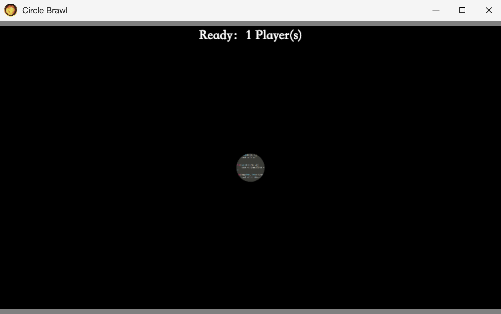

# Circle Brawl Based on Django and jQuery

## Contents

### Pages

HomePage:

<p align="center"></p>

Login:

<p align="center"></p>

App-end:

<p align="center"></p>

### Directory Structure

```
.
├── app
│   ├── settings.py
│   └── urls.py
├── db.sqlite3
├── match_system
│   ├── thrift
│   └───match_server
├── game
│   ├── migrations
│   ├── routing : websocket urls
│   ├── models : Manage database
│   │   └── players
│   ├── static
│   │   ├── css : Manage the styles of game objects, such as position, width, color, background, font size, etc.
│   │   ├── image : Manage the logic of game objects, such as object creation and destruction, event functions, movement, color change, etc.
│   │   └── js
│   │       ├── dist
│   │       └── src
│   │           ├── menu
│   │           ├── settings : manage login, register page
│   │           └── playground
│   │               ├── ball_game_object
│   │               ├── game_map
│   │               ├── particle
│   │               ├── player
│   │               ├── notice_board
│   │               ├── chatbox
│   │               ├── socket : wss
│   │               │   └── multiplayer
│   │               └── skills
│   │                   ├── shield
│   │                   └── fireball
│   ├── templates : Manage html files
│   │   └── multiends
│   │       └── web.html
│   ├── consumers : websocket views
│   │   └── multiplayer : Online multiplayer battles
│   │       ├── create-player
│   │       ├── move-to
│   │       ├── shoot-fireball
│   │       ├── attack
│   │       ├── shoot-field
│   │       └── message
│   ├── urls : Manage routings - correspondence between links and functions
│   │   ├── menu
│   │   ├── playground
│   │   └── settings
│   └── views : Manage HTTP functions
│       ├── menu
│       ├── playground
│       └── settings
│           ├── getinfo
│           ├── login
│           ├── logout
│           ├── register
│           └── third_party : include web-end and app-end
│               ├── apply_code
│               └── receive_code
├── scripts : automatically generate js/dist
│   ├── compress_game_js.sh : package /js/src files
│   └── uwsgi.ini
├── static : store all static files used in templates/multiends/web.html
└── showpic : store images used in readme.md
```

### URL Routing

Enter Url -> app.urls -> game.urls -> game.views.index -> Show Page

### Data Flow

| Functions | Backend Sender                                         | Frontend Sender       | Frontend Receiver        |
| :-------: | :----------------------------------------------------- | :-------------------- | :----------------------- |
|   Move    | async move_to() <br> channel_layer.group_send()        | send_move_to()        | receive_move_to()        |
|  Attack   | async attack() <br> channel_layer.group_send()         | send_attack()         | receive_attack()         |
| Fireball  | async shoot_fireball() <br> channel_layer.group_send() | send_shoot_fireball() | receive_shoot_fireball() |
|   Flash   | async flash() <br> channel_layer.group_send()          | send_flash()          | receive_flash()          |
|  Shield   | async shoot_shield() <br> channel_layer.group_send()   | send_shoot_shield()   | receive_shoot_shield()   |
|  Message  | async message() <br> channel_layer.group_send()        | send_message()        | receive_message()        |

## Operations

1. Right click mouse to move;
2. Press keyboard 'Q' to choose skill - FireBall, skill CD = 3s;
3. Press keyboard 'F' to choose skill - Flash, skill CD = 5s;
4. Press keyboard 'S' to choose skill - Shield, skill CD = 10s;
5. Left Click mouse to release skills;
6. Press keyboard 'Enter' to open chat box and press keyboard 'Esc' to close;
7. At the end of each game, left click mouse once to exit the score board, and then left click again to return to the menu.

## Effects

1. Each skill has a cooldown time, which gradually shortens as the game progresses;
2. Ball's radius represents its "health value", and it will loose when the radius is 0;
3. After being attacked, the radius of the ball is halved and the speed is increased by 25%;
4. When hit, the ball will randomly release 10-15 small particles. The color of the particle is the same as that of the ball, the speed is ten times that of the ball, and other parameters are randomly generated;
5. The first five seconds of the game is the player's protection period, AI players will not attack.
6. Player matchmaking will prioritize selecting opponents with similar scores.

## Tech-Stack

1. Redis
    <br>Because the game data, including user data and data generated during the game, is characterized as key-value pairs, only accessed by a single thread, and only requires temporary storage, the game data communication between the front-end and back-end uses Redis as the database. The key represents the room number and the value represents the communication data.
2. Websocket Bidirectional Communications
    <p align="center"></p>
3. Matching System
    <br>The matching system is composed of a message queue, a producer-consumer model, and a matching pool. The matching system communicates with the Game Server using thrift.
    <br>player sends connection request to Game Server -> Game server sends connection channel to player -> player sends add_player request to Game Server -> Game Server sends matching request to Matching Server -> Matching Server sends room_info to Game Server ->Game Server sends room_info to player
4. Scoring Algorithm
    <br>The scoring system adopts the Elo Score rating system.
5. JWT
