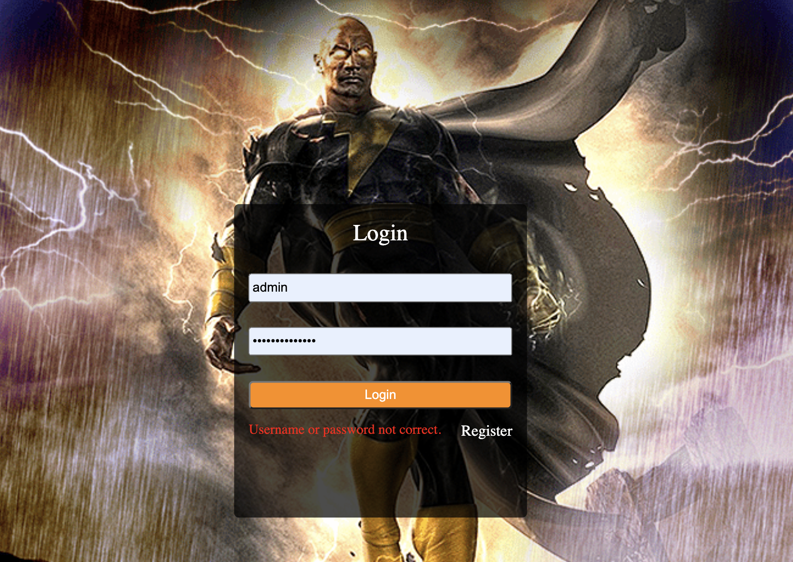

# Circle Brawl Based on Django and jQuery

## Contents
### Pages
HomePage:
<p align="center"></p>
Login:
<p align="center"></p>

### Directory Structure
```
.
├── app
│   ├── settings.py
│   └── urls.py
├── db.sqlite3
├── game
│   ├── migrations
│   ├── routing : websocket urls
│   ├── models : Manage database
│   │   └── players
│   ├── static
│   │   ├── css : Manage the styles of game objects, such as position, width, color, background, font size, etc.
│   │   ├── image : Manage the logic of game objects, such as object creation and destruction, event functions, movement, color change, etc.
│   │   └── js
│   │       ├── dist
│   │       └── src
│   │           ├── menu
│   │           ├── settings : manage login, register page
│   │           └── playground
│   │               ├── ball_game_object
│   │               ├── game_map
│   │               ├── particle
│   │               ├── player
│   │               ├── socket : wss
│   │               │   ├── chat
│   │               │   └── multiplayer
│   │               └── skills
│   │                   └── fireball
│   ├── templates : Manage html files
│   │   └── multiends
│   │       └── web.html
│   ├── consumers : websocket views
│   │   ├── chat
│   │   └── multiplayer : Online multiplayer battles
│   │       ├── create-player
│   │       ├── move-to
│   │       ├── shoot-fireball
│   │       └── attack
│   ├── urls : Manage routings - correspondence between links and functions
│   │   ├── menu
│   │   ├── playground
│   │   └── settings
│   └── views : Manage HTTP functions
│       ├── menu
│       ├── playground
│       └── settings
│           ├── getinfo
│           ├── login
│           ├── logout
│           ├── register
│           └── third_party : include web-end and app-end
│               ├── apply_code
│               └── receive_code
├── scripts : automatically generate js/dist
│   ├── compress_game_js.sh : package /js/src files
│   └── uwsgi.ini
├── static : store all static files used in templates/multiends/web.html
└── showpic : store images used in readme.md
```

### URL Routing
Enter Url  -> app.urls -> game.urls -> game.views.index -> Show Page

## Operations
1. Right click mouse to move;
2. Press keyboard 'Q' to choose skill - FireBall;
3. Left Click mouse to attack (always choose a skill before attaching). 

## Effects
1. After being attacked, the radius of the ball is halved and the speed is increased by 25%. One ball is out when its radius is less than zero.
2. When hit, the ball will randomly release 10-15 small particles. The color of the particle is the same as that of the ball, the speed is ten times that of the ball, and other parameters are randomly generated.
3. The first five seconds of the game is the player's protection period, AI players will not attack.

## Tech-Stack
1. Redis
   
2. Websocket Bidirectional Communications
