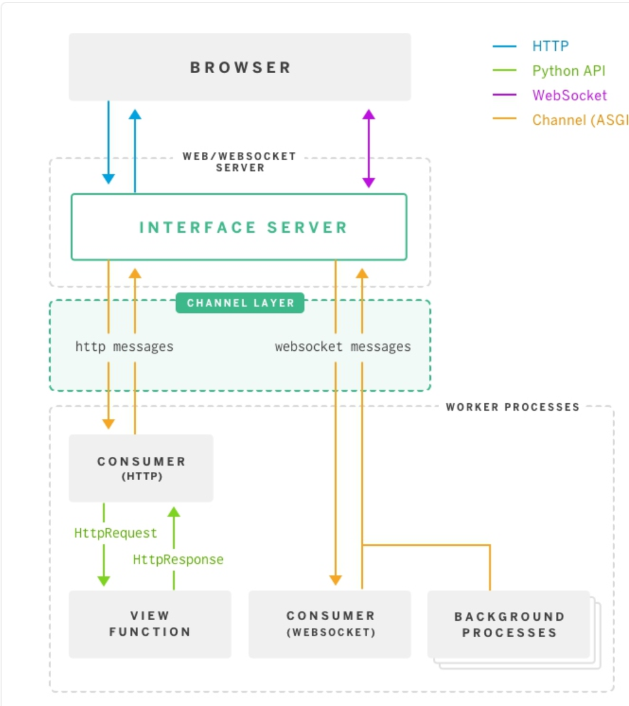

# Circle Brawl Based on Django and jQuery

## Contents

### Pages

HomePage:

<p align="center"></p>

Login:

<p align="center"></p>

App-end:

<p align="center"></p>

### Directory Structure

```
.
├── app
│   ├── settings.py
│   └── urls.py
├── db.sqlite3
├── game
│   ├── migrations
│   ├── routing : websocket urls
│   ├── models : Manage database
│   │   └── players
│   ├── static
│   │   ├── css : Manage the styles of game objects, such as position, width, color, background, font size, etc.
│   │   ├── image : Manage the logic of game objects, such as object creation and destruction, event functions, movement, color change, etc.
│   │   └── js
│   │       ├── dist
│   │       └── src
│   │           ├── menu
│   │           ├── settings : manage login, register page
│   │           └── playground
│   │               ├── ball_game_object
│   │               ├── game_map
│   │               ├── particle
│   │               ├── player
│   │               ├── notice_board
│   │               ├── chatbox
│   │               ├── socket : wss
│   │               │   └── multiplayer
│   │               └── skills
│   │                   ├── shield
│   │                   └── fireball
│   ├── templates : Manage html files
│   │   └── multiends
│   │       └── web.html
│   ├── consumers : websocket views
│   │   ├── chat
│   │   └── multiplayer : Online multiplayer battles
│   │       ├── create-player
│   │       ├── move-to
│   │       ├── shoot-fireball
│   │       └── attack
│   ├── urls : Manage routings - correspondence between links and functions
│   │   ├── menu
│   │   ├── playground
│   │   └── settings
│   └── views : Manage HTTP functions
│       ├── menu
│       ├── playground
│       └── settings
│           ├── getinfo
│           ├── login
│           ├── logout
│           ├── register
│           └── third_party : include web-end and app-end
│               ├── apply_code
│               └── receive_code
├── scripts : automatically generate js/dist
│   ├── compress_game_js.sh : package /js/src files
│   └── uwsgi.ini
├── static : store all static files used in templates/multiends/web.html
└── showpic : store images used in readme.md
```

### URL Routing

Enter Url -> app.urls -> game.urls -> game.views.index -> Show Page

### Data Flow

| Functions | Backend Sender                                     | Frontend Sender                                              | Frontend Receiver                                                      |
| :-------: | :------------------------------------------------- | :----------------------------------------------------------- | :--------------------------------------------------------------------- |
|   Move    | async move_to <br> channel_layer.group_send        | send_move_to(to_x,to_y)                                      | receive_move_to(u_uid, to_x, to_y)                                     |
|  Attack   | async attack <br> channel_layer.group_send         | send_attack(attacked_u_uid, x, y, angle, damage, ball_u_uid) | receive_attack(u_uid, attacked_u_uid, x, y, angle, damage, ball_u_uid) |
| Fireball  | async shoot_fireball <br> channel_layer.group_send | send_shoot_fireball(to_x, to_y, ball_u_uid)                  | receive_shoot_fireball(u_uid, to_x, to_y, ball_u_uid)                  |
|   Flash   | async flash <br> channel_layer.group_send          | send_flash(to_x, to_y)                                       | receive_blink(u_uid, to_x, to_y)                                       |

## Operations

1. Right click mouse to move;
2. Press keyboard 'Q' to choose skill - FireBall, skill CD = 3s;
3. Press keyboard 'F' to choose skill - Flash, skill CD = 5s;
4. Press keyboard 'S' to choose skill - Shield, skill CD = 10s;
5. Left Click mouse to release skills;
6. Press keyboard 'Enter' to open chatbox and press keyboard 'Esc' to close.

## Effects

1. Each skill has a cooldown time, which gradually shortens as the game progresses;
2. Ball's radius represents its "health value", and it will loose when the radius is 0;
3. After being attacked, the radius of the ball is halved and the speed is increased by 25%;
4. When hit, the ball will randomly release 10-15 small particles. The color of the particle is the same as that of the ball, the speed is ten times that of the ball, and other parameters are randomly generated;
5. The first five seconds of the game is the player's protection period, AI players will not attack.

## Tech-Stack

1. Redis
2. Websocket Bidirectional Communications
<p align="center"></p>
